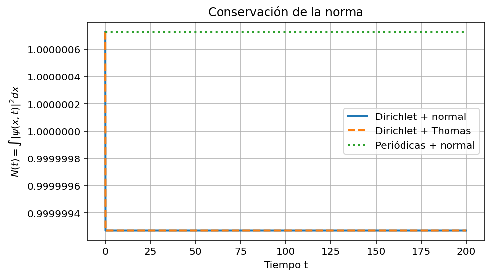
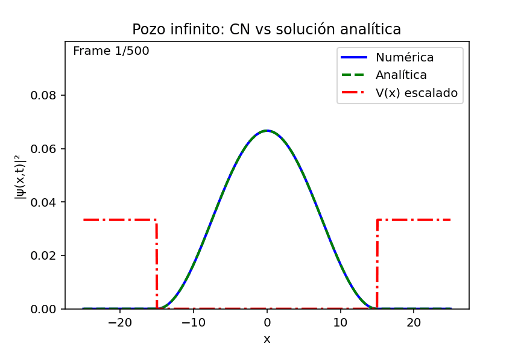
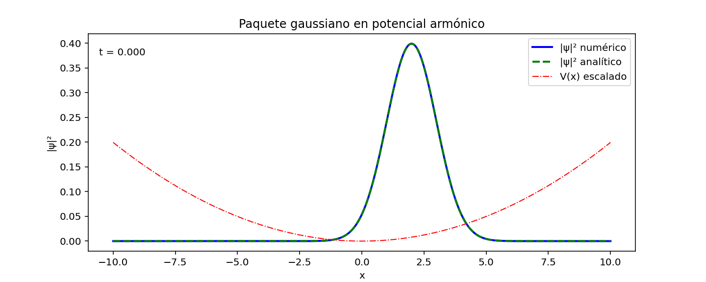
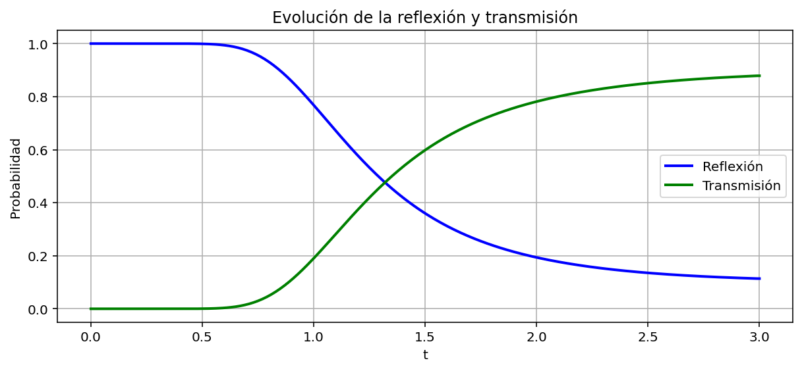
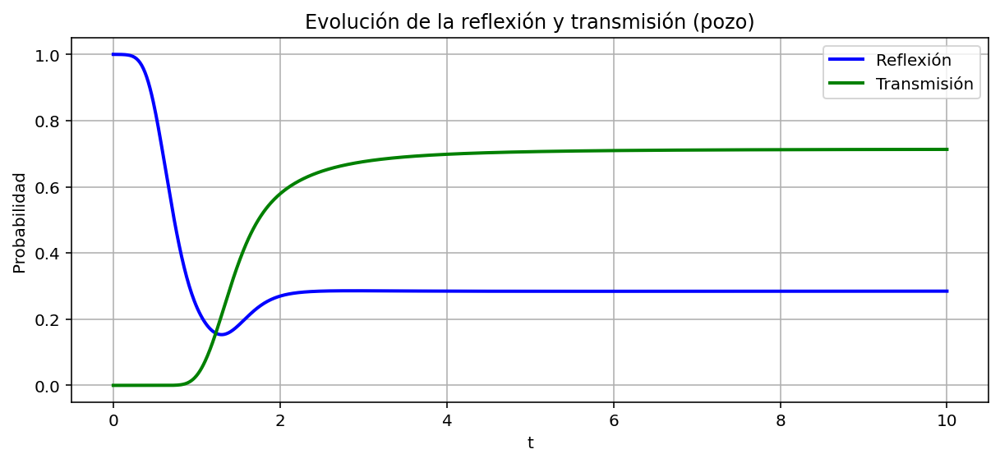

# 1D Schrödinger Equation with Crank–Nicolson Wave-Packet Simulations

This portfolio project organizes a coursework/research-style numerical study of the 1D time-dependent Schrödinger equation using Crank–Nicolson propagation of Gaussian wave packets, including boundary-condition analysis, solver comparisons, conservation checks, and scattering diagnostics.

## 1. Scientific motivation
The objective is to simulate quantum wave-packet dynamics in one spatial dimension and evaluate numerical behavior under different physical setups and boundary conditions.

## 2. Time-dependent Schrödinger equation in 1D
The simulations solve the standard 1D time-dependent Schrödinger equation for a complex wave function $\psi(x,t)$, with user-defined potentials for free propagation, wells, barriers, and harmonic confinement.

## 3. Gaussian wave-packet initialization
Initial states are Gaussian wave packets with configurable center, width, and carrier wave number, normalized numerically before time evolution.

## 4. Crank–Nicolson time evolution
Time stepping follows the Crank–Nicolson implicit midpoint discretization, yielding stable linear systems at each step.

## 5. Dirichlet and periodic boundary conditions
The implementation includes both:
- **Dirichlet boundaries** (hard-wall endpoints).
- **Periodic boundaries** (wrapped spatial domain couplings).

## 6. Thomas algorithm versus dense linear solver
For tridiagonal systems (Dirichlet case), the project compares:
- Dense linear solve (`numpy.linalg.solve`), and
- Thomas tridiagonal solver.

## 7. Norm conservation
A dedicated diagnostic tracks conservation of \(\int |\psi|^2 dx\) during propagation in the free-packet setting.



## 8. Comparison with analytical or spectral reference solutions
The repository contains visual comparisons against analytical/spectral references where applicable, plus absolute error plotting for the infinite-well case.

## 9. Infinite well and harmonic oscillator examples
Examples include:
- Infinite well packet evolution and CN vs analytical comparison.
- Harmonic-potential packet comparison against analytical behavior.




## 10. Reflection and transmission through wells/barriers
Scattering diagnostics are included for finite wells and rectangular barriers using reflection/transmission trends.




## 11. Repository structure

```text
src/
  schrodinger_crank_nicolson.py

docs/
  theory.md
  numerical_method.md
  results_summary.md
  sources_and_notes.md

figures/
  free_packet/
  boundary_conditions/
  validation/
  analytical_comparison/
  scattering/
  performance/

notes/
  original_course_report/

raw_upload/
```

