# Results Summary

This document summarizes the main numerical results of the one-dimensional Schrödinger simulations. The focus is on qualitative validation: correct wave-packet evolution, conservation of probability, comparison between solvers, convergence behaviour and physically meaningful reflection/transmission diagnostics.

---

## 1. Free Gaussian wave packet

The free-particle case uses

$$
V(x)=0.
$$

The initial state is a normalized Gaussian packet with a complex phase factor. The phase gives the packet a nonzero mean momentum, so the probability density moves across the numerical domain.

The free-packet animation shows the expected behaviour: the packet propagates while also spreading. This spreading is a purely quantum effect. A localized wave packet is not a single momentum eigenstate; it contains a distribution of momenta, and the different components accumulate different phases during time evolution.

Recommended figure:

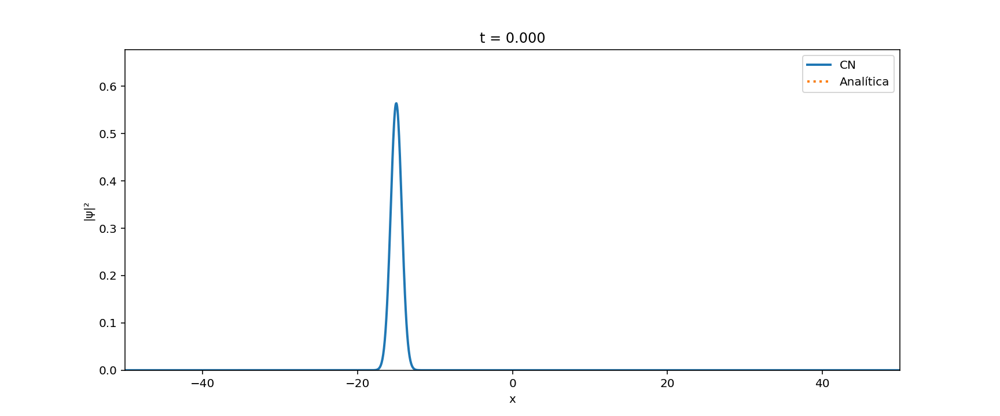

---

## 2. Boundary-condition comparison

The repository compares Dirichlet and periodic boundary conditions.

With Dirichlet boundary conditions, the wave function vanishes at the edges. This behaves like a hard-wall box. If the wave packet reaches the boundary, it reflects.

With periodic boundary conditions, the packet leaving one side of the domain reappears from the other side. This tests a different physical topology and also changes the matrix structure of the numerical problem.

Recommended figure:

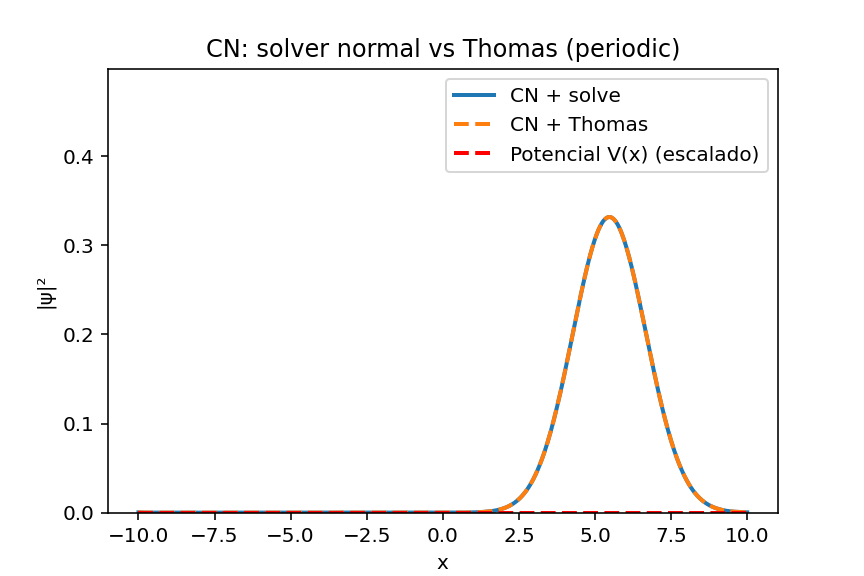

The comparison is useful because it shows that boundary conditions are not just a numerical detail. They define the physical problem being solved.

---

## 3. Dense solver versus Thomas algorithm

For Dirichlet boundary conditions, the Crank–Nicolson matrices are tridiagonal. This allows the linear system to be solved with the Thomas algorithm.

The dense solver and the Thomas solver should produce essentially the same physical evolution when applied to the same Dirichlet problem. The purpose of comparing them is not to change the physics, but to test whether the specialized tridiagonal solver reproduces the same result more efficiently.

Recommended figure:

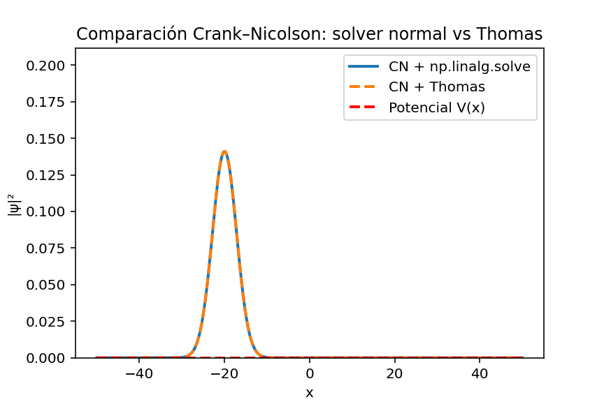

The important conclusion is that exploiting matrix structure matters. In a one-dimensional finite-difference problem, the Hamiltonian couples only nearest neighbours, so a tridiagonal solver is mathematically natural and computationally efficient.

---

## 4. Conservation of norm

The norm is

$$
N(t)=\int |\psi(x,t)|^2 dx.
$$

For Schrödinger evolution, this quantity should remain constant. The norm-conservation plot is therefore one of the most important validation tests.

Recommended figure:

The expected behaviour is that $N(t)$ remains very close to its initial value. Small deviations can arise from finite grid resolution, floating-point roundoff, boundary effects or explicit renormalization choices in some parts of the code.

A method that produces a large systematic norm drift would not be reliable for quantum dynamics. Crank–Nicolson is chosen precisely because it has strong norm-conservation properties for Hermitian Hamiltonians.

---

## 5. Convergence diagnostics

The convergence plots compare how the numerical error changes with the spatial step, time step, boundary condition and solver choice.

Recommended figures:

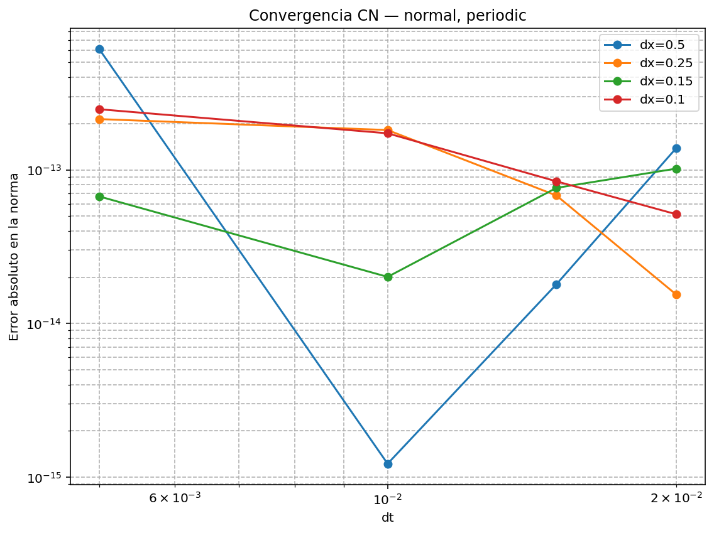

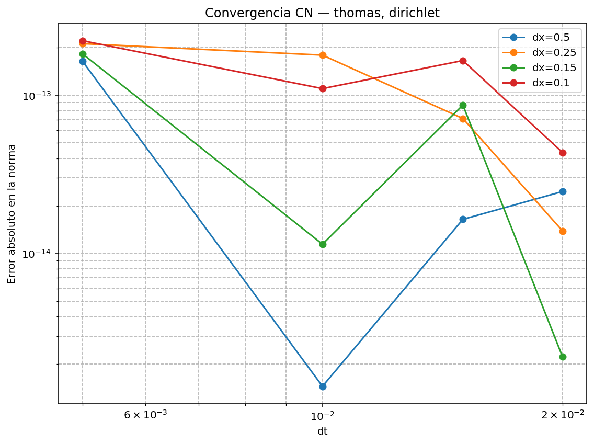

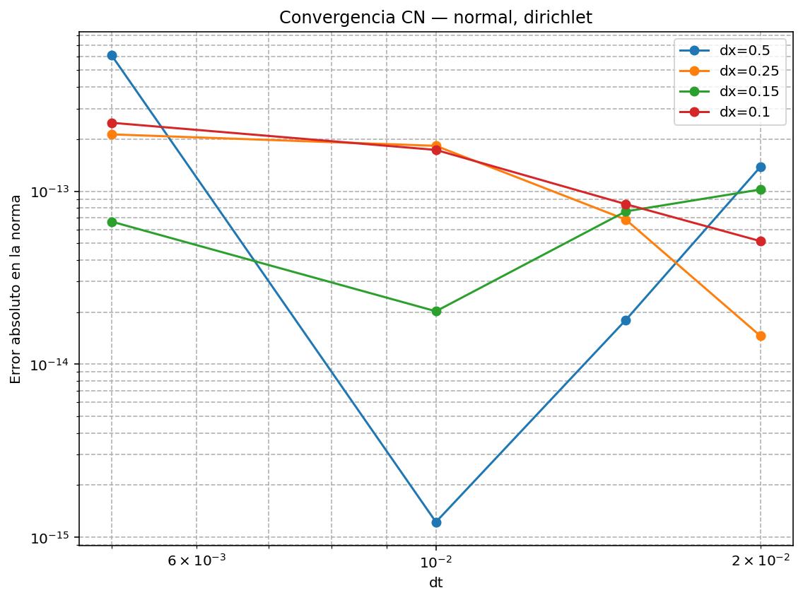

The main interpretation is that numerical accuracy depends on both $\Delta x$ and $\Delta t$. Refining the grid generally improves the representation of the second derivative, while reducing the time step improves the temporal approximation.

Crank–Nicolson is second order in time, but the full observed error also depends on spatial discretization, boundary conditions and the diagnostic used to measure error.

---

## 6. Computational cost

The computational-cost plots compare the dense solver and Thomas solver under different boundary conditions.

Recommended figures:

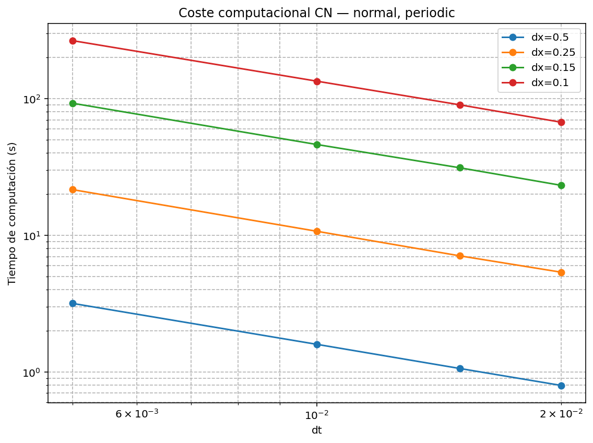

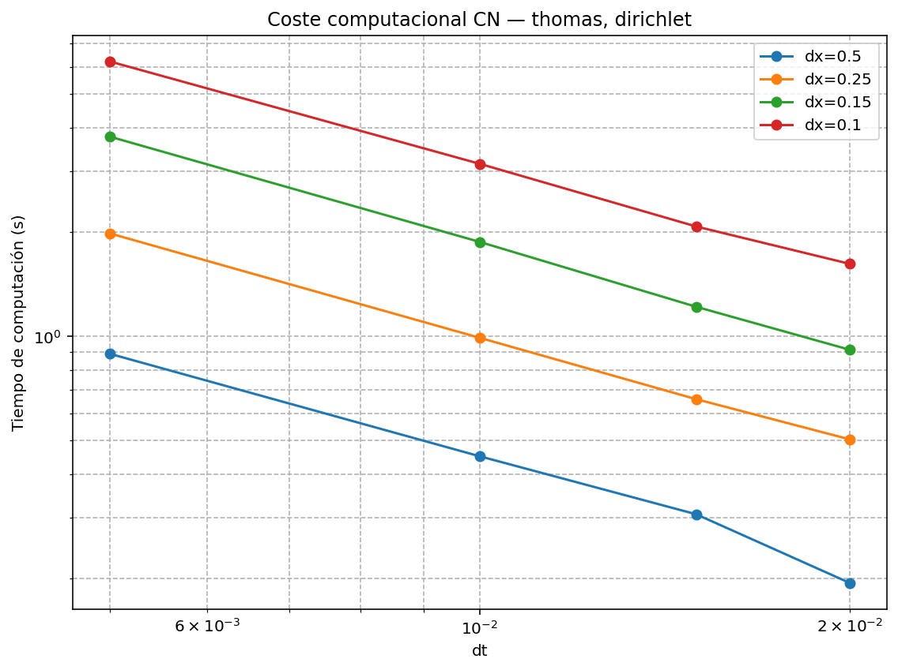

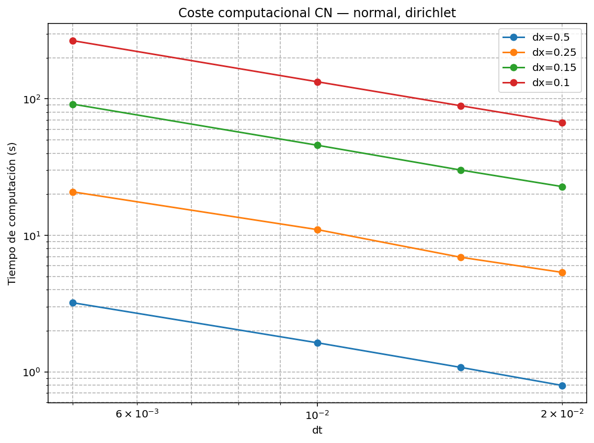

The expected result is that Thomas becomes advantageous when the matrix is tridiagonal and the number of grid points is sufficiently large. Dense solvers are general and convenient, but they do not exploit the special nearest-neighbour structure of the one-dimensional finite-difference Hamiltonian.

Periodic boundary conditions introduce corner couplings between the first and last grid points. This breaks the simple tridiagonal structure, so the basic Thomas algorithm is not directly applicable without modification.

---

## 7. Infinite well comparison

The infinite-well case is a strong validation test because analytical stationary states are known. If the initial condition is an eigenstate, the probability density should remain stationary in time, while the complex phase evolves.

Recommended figures:

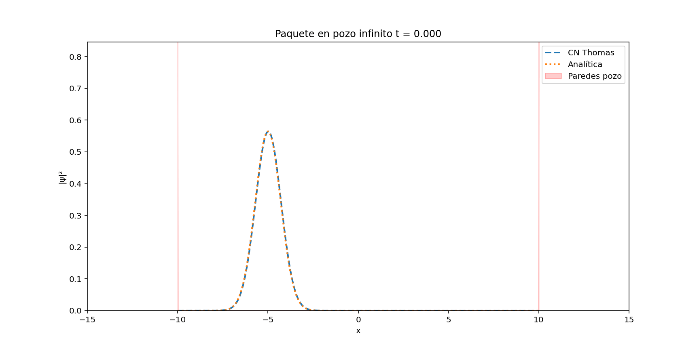

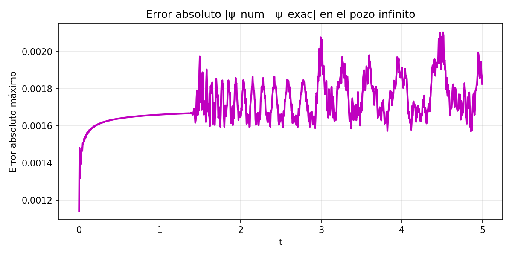

The comparison between Crank–Nicolson and the analytical solution checks whether the numerical method reproduces the expected quantum dynamics. The error plot provides a direct diagnostic of the numerical approximation.

---

## 8. Harmonic oscillator packet

The harmonic oscillator potential is

$$
V(x)=\frac{1}{2}\omega^2x^2.
$$

A Gaussian packet in a harmonic potential should oscillate in the confining potential. This test is useful because the motion has a clear physical interpretation: the packet is pulled back toward the centre by the quadratic potential.

Recommended figure:

This case tests whether the numerical method can reproduce bound-state-like dynamics, not only free propagation.

---

## 9. Packet spreading

The free Gaussian packet spreads over time because it is a superposition of momentum components. The width of the packet is therefore a physically meaningful observable.

Recommended figure:

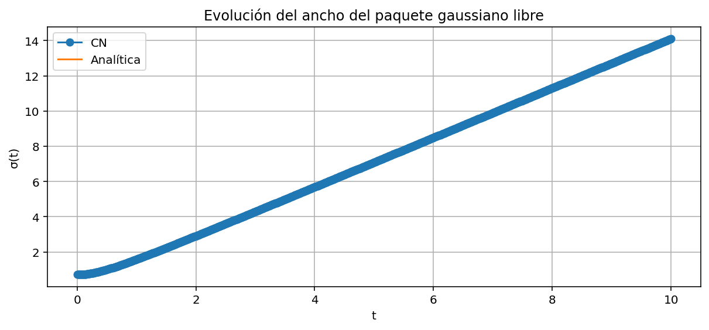

The qualitative expectation is that the width increases during free evolution. This confirms that the simulation is not merely translating the packet rigidly; it is resolving the dispersive nature of the Schrödinger equation.

---

## 10. Reflection and transmission

The finite well and rectangular barrier cases demonstrate scattering. A wave packet incident on a localized potential does not generally pass through completely. Instead, part of the probability density is reflected and part is transmitted.

Recommended figures:

The reflected and transmitted probabilities are estimated by integrating $|\psi|^2$ on opposite sides of the scattering region:

$$
R(t)=\int_{\mathrm{left}}|\psi(x,t)|^2dx,
$$

$$
T(t)=\int_{\mathrm{right}}|\psi(x,t)|^2dx.
$$

After the interaction with the potential, these quantities indicate how the wave packet has split. A good simulation should keep the total probability approximately conserved while resolving the reflected and transmitted components.

---

## 11. Main conclusions

The project demonstrates that Crank–Nicolson is a robust method for one-dimensional quantum time evolution. It preserves the norm well, handles free propagation and bound-state examples, and can be combined with the Thomas algorithm for efficient Dirichlet problems.

The most important conclusions are:

- Crank–Nicolson is preferable to a naive explicit scheme for Schrödinger evolution.
- Boundary conditions define the physical problem and change the matrix structure.
- Dirichlet problems produce tridiagonal systems suitable for Thomas.
- Periodic problems require a more general treatment because of endpoint coupling.
- Norm conservation is the key validation check.
- Analytical and spectral comparisons are essential for verifying the implementation.
- Scattering simulations provide physically meaningful reflection/transmission diagnostics.

Overall, this repository shows a complete workflow for computational quantum mechanics in one dimension.
